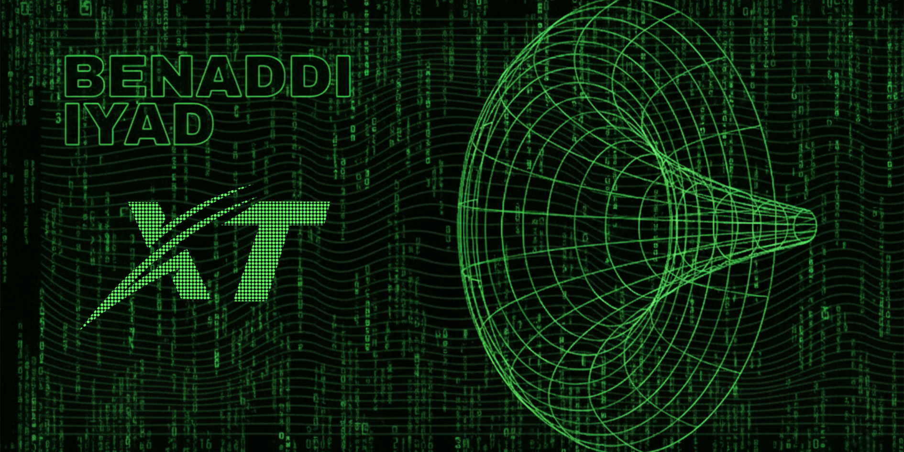

<!--------------------------------------- My Universe ------------------------------->
<!--background-->

<!--------------------------------------- My Universe ------------------------------->

<h2 align="center"> 
  
</h2>

- > 𝐒𝐲𝐬𝐭𝐞𝐦 𝐁𝐨𝐨𝐭𝐢𝐧𝐠...
  
- > 𝐑𝐮𝐧𝐢𝐧𝐠 𝐦𝐨𝐭𝐢𝐯𝐚𝐭𝐢𝐨𝐧.𝐝𝐥𝐥...

- > 𝐂𝐭𝐫𝐥 + 𝐀𝐥𝐭 + 𝐒𝐮𝐜𝐜𝐞𝐬𝐬?

- > 𝐋𝐄𝐀𝐑𝐍𝐈𝐍𝐆_𝐋𝐎𝐎𝐏.𝐬𝐭𝐚𝐫𝐭()

- > 𝐏𝐫𝐨𝐠𝐫𝐞𝐬𝐬 : [▮▮▮▮▮▮▮▯▯▯] 70%
  
- > 𝐖𝐚𝐫𝐧𝐢𝐧𝐠 : 𝐟𝐞𝐚𝐫_𝐨𝐟_𝐟𝐚𝐢𝐥𝐮𝐫𝐞 𝐧𝐨𝐭 𝐝𝐞𝐟𝐢𝐧𝐞𝐝

- > 𝐎𝐮𝐭𝐩𝐮𝐭: 𝐁𝐞𝐧𝐚𝐝𝐝𝐢𝐈𝐲𝐚𝐝.𝐞𝐱𝐞

- > 𝐌𝐲 𝐨𝐧𝐥𝐲 𝐜𝐨𝐦𝐩𝐞𝐭𝐢𝐭𝐢𝐨𝐧 𝐢𝐬 𝐭𝐡𝐞 𝐩𝐞𝐫𝐬𝐨𝐧 𝐈 𝐰𝐚𝐬 𝐲𝐞𝐬𝐭𝐞𝐫𝐝𝐚𝐲.

<!--Languages and Tools Section-->       

<h2 align="center"> 
  
</h2>

<picture>
  <source media="(prefers-color-scheme: dark)" srcset="./Skills_Showcase_Dark.gif">
  <source media="(prefers-color-scheme: light)" srcset="./Skills_Showcase_White.gif">
  
</picture>
 

<h3 align="center">Building Strong Foundations</h3>
<ul align="left">
  
    - > HTML, CSS, JavaScript, Git & GitHub 🧩
  
    - > VS Code & Developer Tools 🛠️
    
    - > Python (Currently Learning) 🐍
    
    - > Computer Science Fundamentals 🧠
    
    - > Cyber Security Basics 🛡️
      
    - > Learning Journey & Tech Blogs 🚀

</ul>

 
 

<!--------------------------------------- Project BlackWarriors ------------------------------->

<h3 align="center"> 
  
</h3>

<table>
<tr>
<td width="50%" align="center" valign="middle">

[Black Warriors](https://blackwarriors.io) is an all-in-one platform for fun, entertainment, and learning.
Enjoy games, movies, courses, quizzes, music, apps, and more —
all directly in your browser.  

Follow us on social media to stay updated.
Please respect the rules to avoid any issues.

 

📖 Need help? Visit our [Help Center](https://support.Blackwarriors{darori trja3}.io/)

 

Made with ❤️ by the Black Warriors Team, around the World

</td>
<td width="50%" align="center" valign="middle">

 

**🐧 Linux & DevOps**

**🕵️ Cybersecurity**

**🧑‍💻 Programming**

**🧠 Data & AI**

** Web Development**

**🌐 Social Media**

 

</td>
</tr>
</table>

<!--------------------------------------- My Universe ------------------------------->

<h2 align="center"> 
  
</h2>

  
  
  
  
  
  
  
  
  

<!--------------------------------------- 𝒬𝓊𝓇𝒶𝓃𝒾𝒸 𝒱𝑒𝓇𝓈𝑒 𝑜𝒻 𝒯𝒽𝑒 𝒟𝒶𝓎 ------------------------------->

<h2 align="center"> 
  
</h2>

    
    

<!--------------------------------------- My Universe ------------------------------->

<picture>
  <source media="(prefers-color-scheme: dark)" srcset="https://raw.githubusercontent.com/platane/platane/output/github-contribution-grid-snake-dark.svg">
  <source media="(prefers-color-scheme: light)" srcset="https://raw.githubusercontent.com/platane/platane/output/github-contribution-grid-snake.svg">
  
</picture>

<!--------------------------------------- My Universe ------------------------------->

